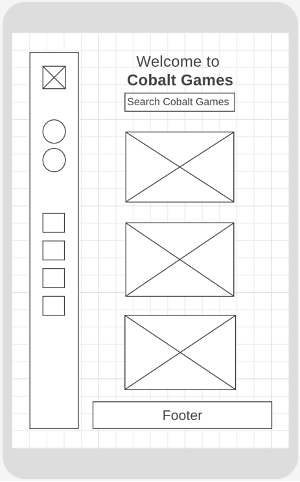
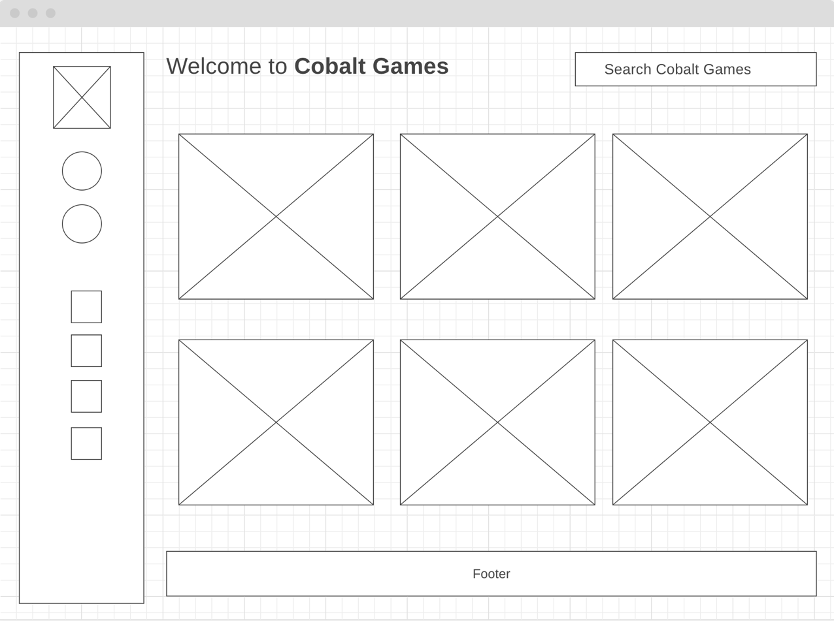

# 🎮 Cobalt Games 👾

## Randomized production URL

👉 https://earnest-narwhal-5d4fdc.netlify.app

## Table of Contents

- [ 🌴 Prerequisites](#-prerequisites)
- [🛠️ Setup](#-setup)
- [📚 Description](#-description)
- [🧞‍♂️ Audience](#🧞‍♂️-audience)
- [💫 Features](#💫-features)
- [🖼️ Wireframes](#🖼️-wireframes)
- [🛹 Trello board](#🛹-trello-board)

## 🌴 Prerequisites

- You must have Node installed. visit https://byui-cit.github.io/advcss/lesson01/l01-software.html and skip to the Node section for instructions

## 🛠️ Setup

- `npm install`
- `npm run start` starts up a local server and updates on any JS or CSS/SCSS changes.

**Other commands**

- `npm run build` to build final files when you are ready to turn in.
- `npm run lint` to run ESLint against your code to find errors.
- `npm run format` to run Prettier to automatically format your code.

## 📚 Description

A video game database website to offer gamers a one-stop source for detailed and current information on video games, including titles, genres, release dates, ratings, and game screenshots. 

This website aims to elevate user experience and become a trusted resource for gamers seeking game-related information and recommendations with the latest releases and developments in the gaming world.

## 🧞‍♂️ Audience
Comprises gamers, enthusiasts, industry professionals, collectors, retailers, and other stakeholders in the gaming world.

## 💫 Features
1.	**Game Information Database**: The application will contain a database of video games, including details such as game titles, genres, release dates, developers, publishers, ratings, and game screenshots.
2.	**Game Details**: When users click on a game from either the list or search results, they can access detailed information about that game. This information may include a game's description, user ratings and reviews, gameplay screenshots, and related recommendations.
3.	**Platform Compatibility**: Users can filter games based on the platforms they are available on, such as PC, Xbox, PlayStation, or mobile.
4.	**Favorites/Bookmarking**: Users can mark games as favorites or add them to their personal lists. This allows for easy access to their preferred games and the ability to track and manage their gaming interests.
5.	**Search Functionality**: Users will be able to search for specific games by typing the game title. The search results will display relevant game entries.

## 🖼️ Wireframes

### Mobile View

### Desktop View

## 🛹 Trello Board
👉 [Link](https://trello.com/invite/b/jUShLO0o/ATTI67a5acb531d138108e7656f48ad31a196BBCEDDC/cobalt-games)